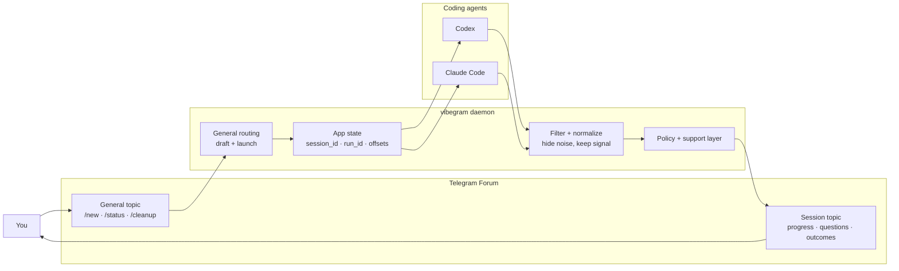

# vibegram

Run Codex and Claude Code from Telegram without drowning in terminal spam.

`vibegram` turns a Telegram Forum into a quiet control room for coding agents:

- one `General` topic to start work and see status
- one topic per active coding session
- filtered, human-readable updates instead of raw transcript noise
- local-first daemon, good for your laptop or a small Ubuntu VPS

## Why people want this

Most agent workflows leak too much implementation detail into the human loop.
You ask for a task, then get buried in `rg`, `sed`, `cat`, and shell chatter.

`vibegram` keeps the useful parts:

- what started
- what changed
- what is blocked
- what needs your answer
- what finished

## How it works



## Core product shape

- one Telegram Forum
- one `General` topic as the control room
- one durable topic per session
- one local daemon that owns state, routing, and provider runs
- direct process runner first
- `systemd` as the default VPS story

## Current status

This repo is already runnable, but still in-progress.

What works now:

- Telegram polling and routing
- `General` commands like `/new`, `/status`, and `/cleanup`
- Codex and Claude session launching
- filtered session output
- Ubuntu `systemd` install path
- GitHub release builds for Linux and macOS

What is still being tightened:

- quieter session rendering
- richer memory and retrieval
- stronger smoke coverage and evals
- tighter approval and escalation paths

## Ubuntu install

Download the latest Linux release from the [releases page](https://github.com/canhta/vibegram/releases).

Example for `v1.0.0`:

```bash
curl -L https://github.com/canhta/vibegram/releases/download/v1.0.0/vibegram_1.0.0_linux_amd64.tar.gz -o vibegram_1.0.0_linux_amd64.tar.gz
tar -xzf vibegram_1.0.0_linux_amd64.tar.gz
sudo install -m 0755 vibegram_1.0.0_linux_amd64/vibegram /usr/local/bin/vibegram
sudo vibegram install
```

The installer will:

- detect the real operator account
- detect `codex` and `claude` paths when possible
- write `/etc/vibegram/env`
- install and start the `systemd` service

## Local run

```bash
go run ./cmd/vibegram
```

## Docs

The repo now keeps only 3 source-of-truth docs:

- [Locked Decisions](./docs/decisions.md)
- [Architecture](./docs/architecture.md)
- [Runtime and Ops](./docs/runtime-ops.md)

## Contributing

If you want to contribute, start with [AGENTS.md](./AGENTS.md) and [CONTRIBUTING.md](./CONTRIBUTING.md).
