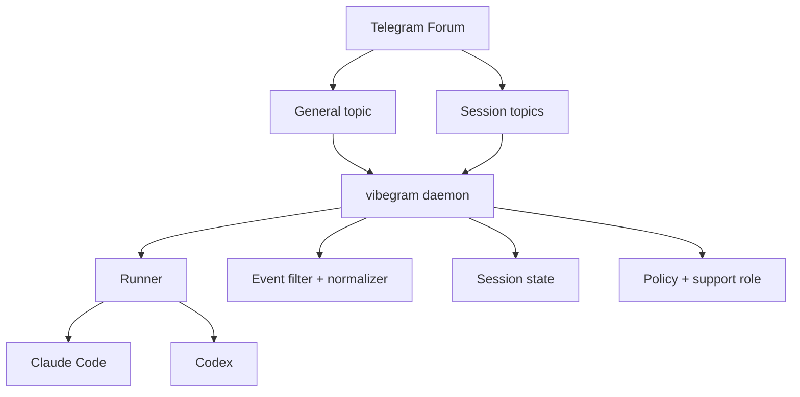

# Architecture

`vibegram` is a Telegram-native control room for coding agents.
The product shape is intentionally small:

- one Telegram Forum
- one `General` topic as the control room
- one durable topic per working session
- one local daemon that owns state, routing, and provider runs

## Product shape

The human should not babysit raw terminal output.
`vibegram` exists to keep Telegram quiet and useful:

- `General` is where you create work, see status, and clean up
- session topics are where an active Codex or Claude run lives
- the daemon turns noisy provider activity into a small set of readable Telegram updates

Non-goals for v1:

- terminal-mirror UX
- cloud control plane
- cross-provider handoff
- self-editing memory
- Telegram Mini App dependency

## System overview



## Telegram model

### General topic

`General` is the control room.
It is not just another thread.

What belongs there:

- `/new`
- `/status`
- `/cleanup`
- light support chat
- session creation
- blocked, done, failed, and critical alerts

### Session topics

Each session topic maps to one app-owned session.

Identity model:

```text
topic_id -> session_id -> run_id -> provider metadata
```

A session topic is durable even if the provider process changes underneath it.

## Session lifecycle

Current V1 flow:

1. User starts a draft from `General` with `/new`
2. User selects provider
3. User selects folder
4. User sends the task text
5. The daemon creates the session topic
6. The daemon launches the provider immediately

The topic name should stay short and operator-friendly.

## Provider model

Supported providers in v1:

- Codex
- Claude Code

Signal priority:

- Claude: `hooks -> transcript -> PTY`
- Codex: `transcript -> PTY`

Adapters are provider-specific.
Filtering and routing are provider-agnostic.

## Event model

The product does not expose raw transcripts as the main UX.

The daemon reduces provider output into a small set of meaningful Telegram-visible events:

- question
- blocked
- failed
- final useful reply
- selected command activity that matters to a human

Read-only exploration noise should stay hidden by default.

## State model

The daemon owns app state locally.

Minimum state:

- session records
- run records
- rolling snapshots
- delivery ledger
- Telegram update offset/checkpoints

This is restart-safe local state, not cloud state.

## Trust boundary

There are three distinct classes:

- trusted policy
- trusted system state
- untrusted provider evidence

The daemon must never let untrusted model output directly grant privilege, widen access, or mutate high-risk state without an explicit trusted policy path.

## Memory

Long-term memory is app-owned Markdown plus a local retrieval index.
OpenAI-compatible inference helps with bounded role execution, but is not the system of record.

## Design stance

When in doubt, prefer:

- fewer visible messages
- durable topic identity
- app-owned state over provider-owned state
- systemd over terminal tricks
- simple boring flows over clever UX layers
