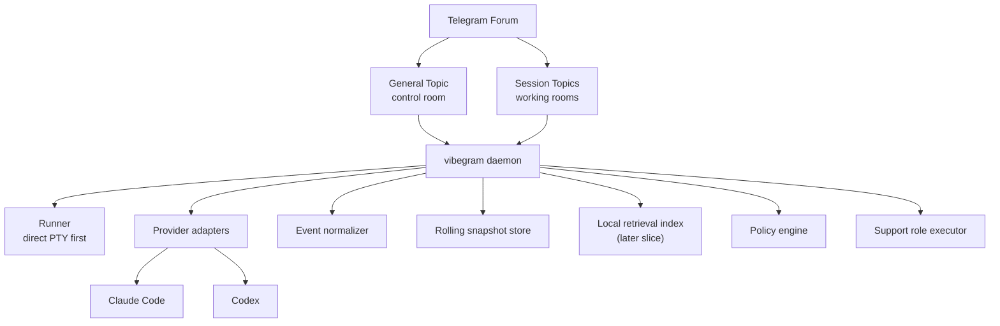
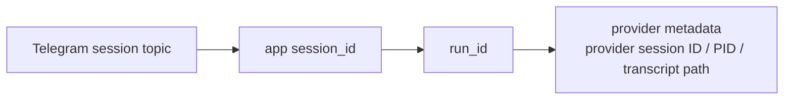
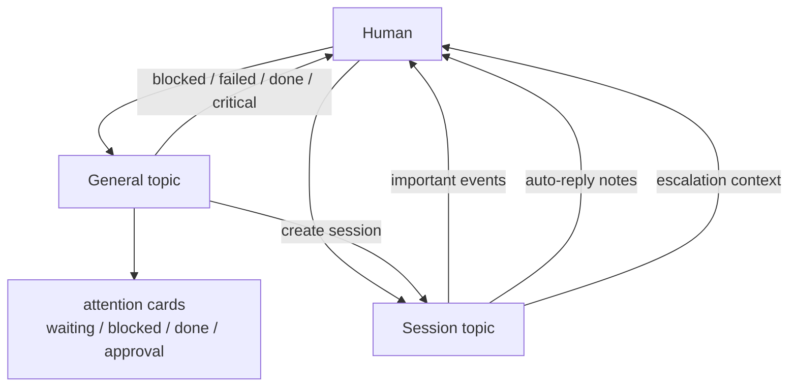
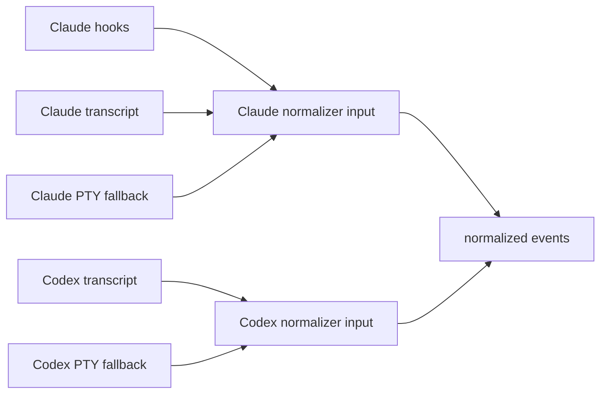
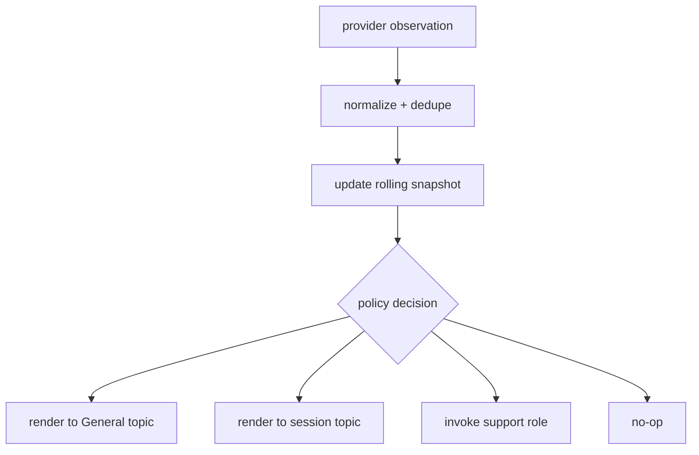
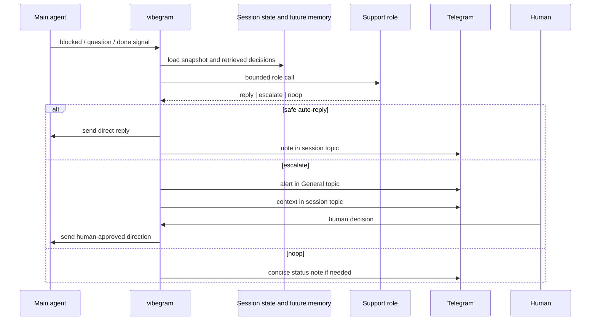
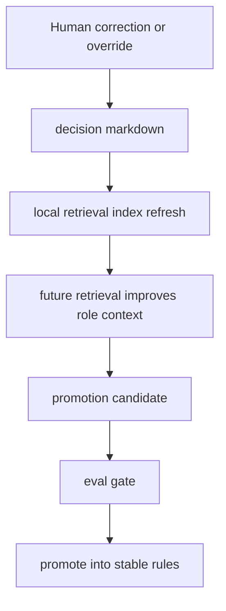
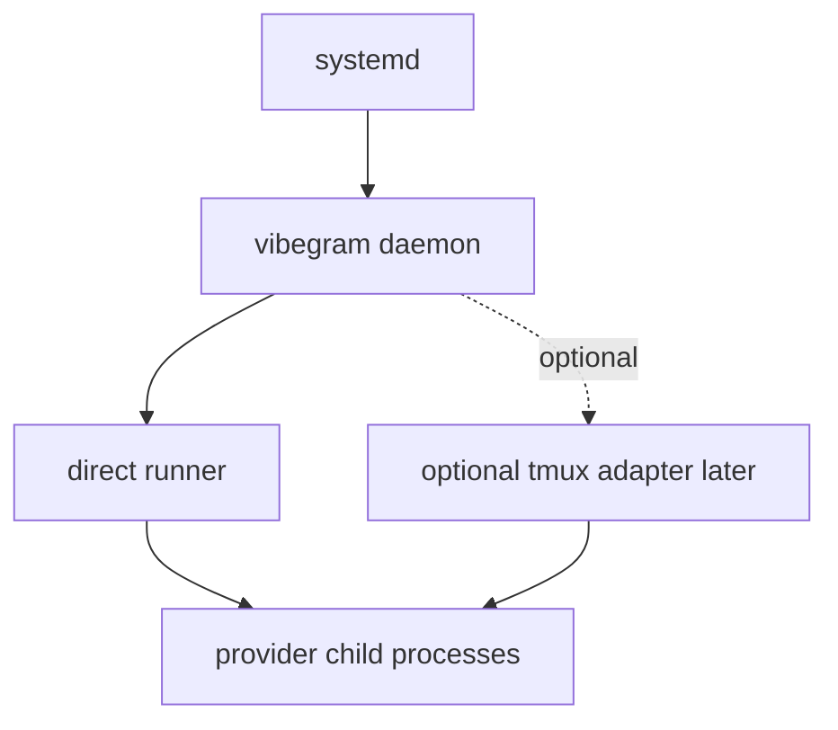
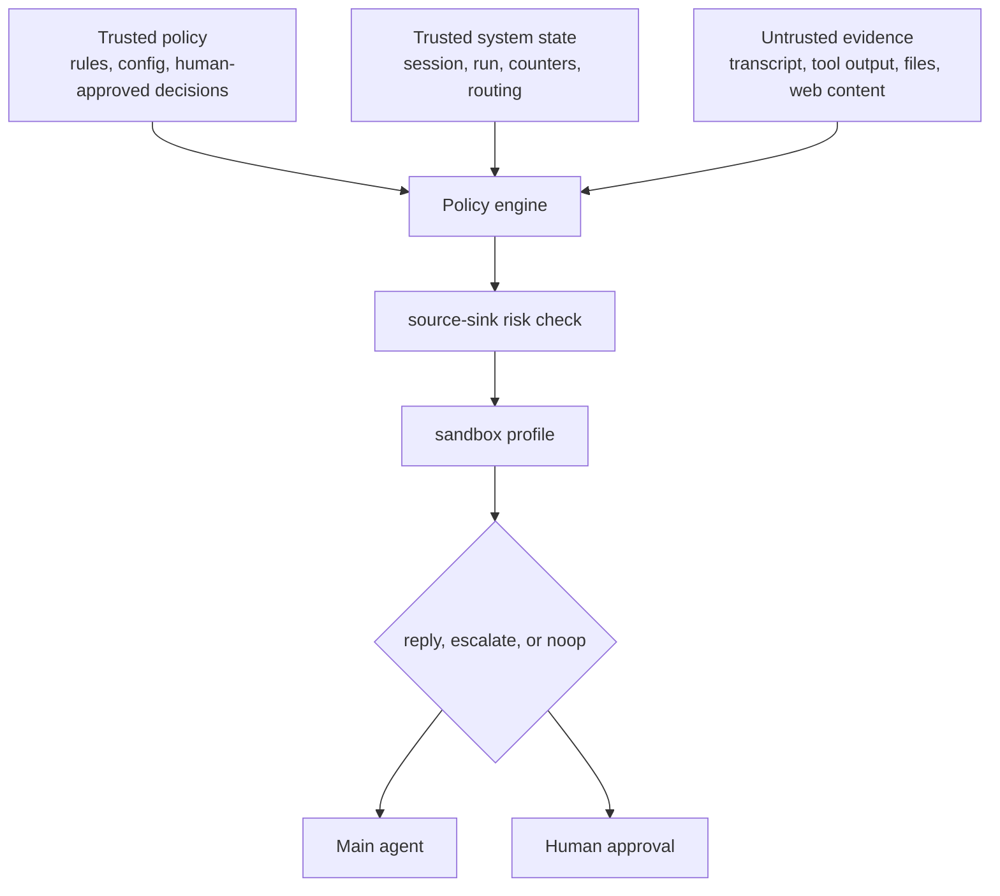
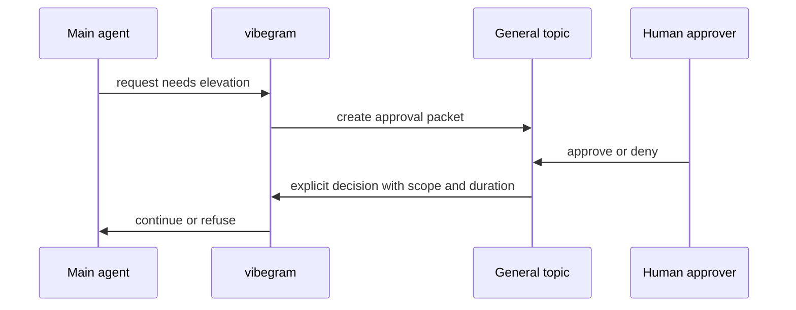

# Diagrams

This document collects the core system diagrams for `vibegram`.

It is intentionally visual and compact. The prose details live in:

- [Architecture](./architecture.md)
- [Telegram Model](./telegram-model.md)
- [Provider Model](./provider-model.md)
- [Session Context](./session-context.md)
- [Automation Safety](./automation-safety.md)

## 1. System Overview

## 2. Identity Model

Why this matters:

- the Telegram topic stays stable
- a provider run can restart or resume underneath it
- runtime mechanics do not become user-facing identity

## 3. Telegram Topic Split

## 4. Provider Signal Priority

Priority rules:

- Claude: hooks first, transcript second, PTY fallback third
- Codex: transcript first, PTY fallback second

## 5. Event Flow

## 6. Auto-Reply and Escalation

## 7. Human Teaching Loop

Important constraint:

- the system may capture teaching automatically
- it must not auto-promote new rules without passing evals

## 8. Runtime Ownership

Default operational stance:

- `systemd` owns uptime
- direct runner is the normal path
- `tmux` is optional, not required

## 9. Trust Boundary and Elevation

Design rule:

- untrusted evidence may influence reasoning
- it may not become authority
- elevated permissions require explicit approval or static policy

## 10. Approval Packet Flow

